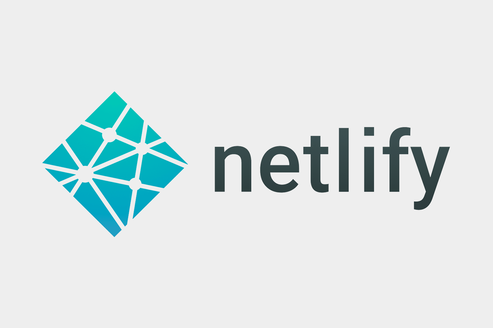
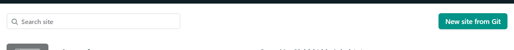
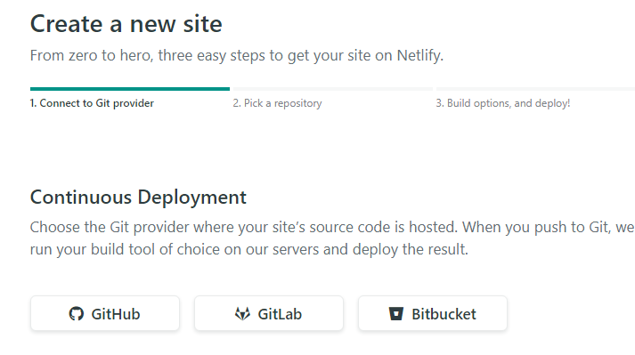
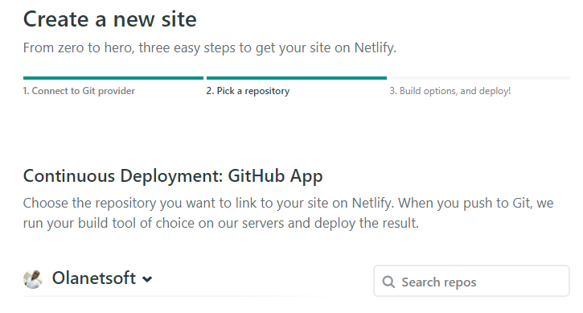
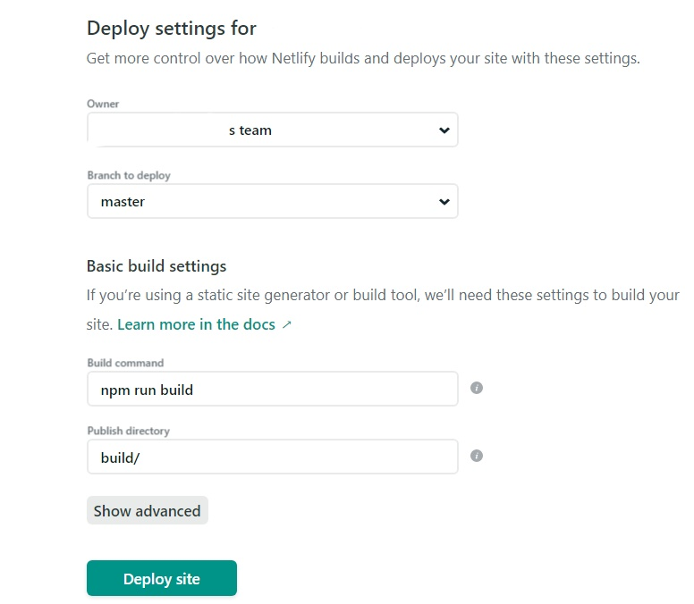
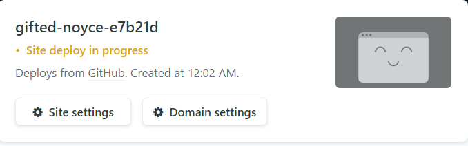
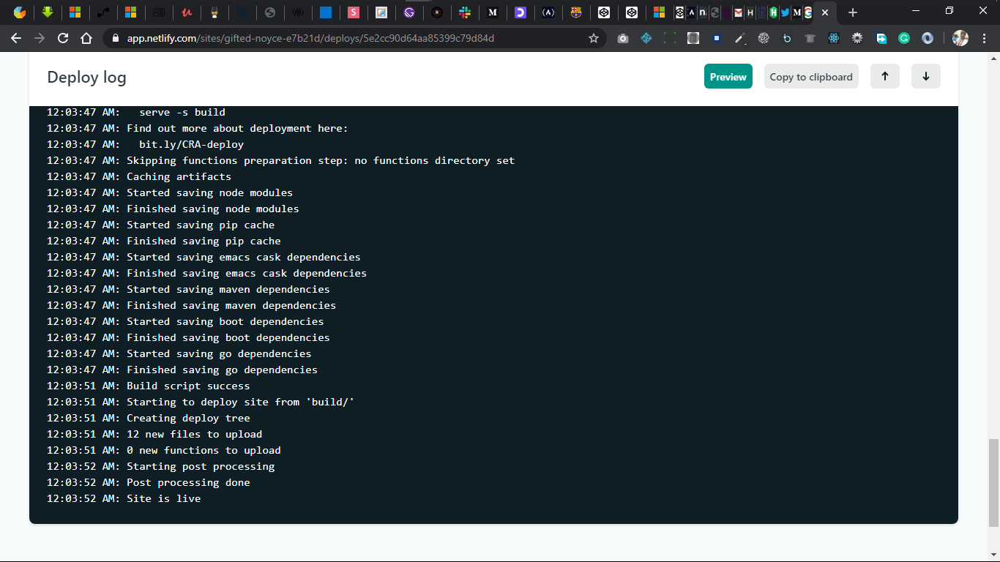
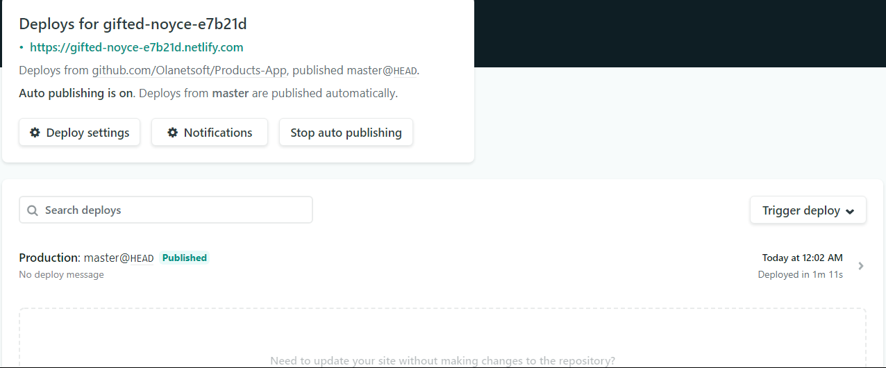
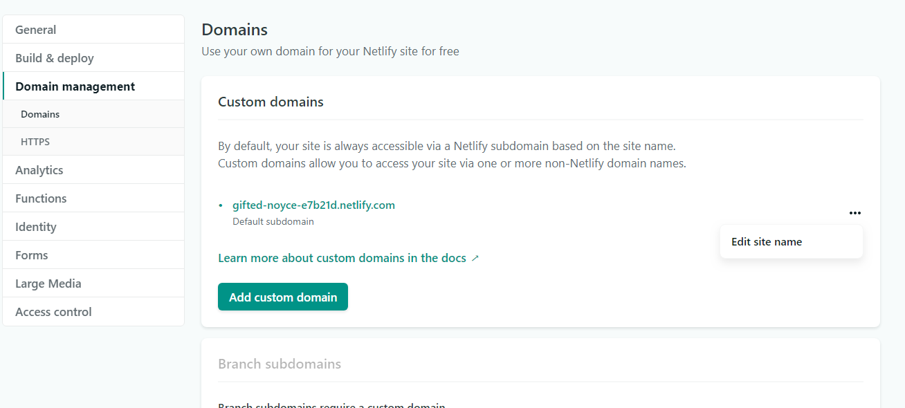

***
Hi guys! It trust y’all had a good day?

Today’s article will be focusing on [Netlify](https://www.netlify.com "Netlify Homepage") hmm :)

The name sounds familiar, right? but you haven't used it to deploy any of your web apps trust me I know how you feel. I will take you through the steps to take to have your site deployed to [Netlify](https://www.netlify.com "Netlify Homepage") in less than 4minutes.

<!--  -->

## What Is Netlify?
***

Netlify is an all-in-one platform for automating modern web projects. Replace your hosting infrastructure, continuous integration, and deployment pipeline with a single workflow. Integrate dynamic functionality like serverless functions, user authentication, and form handling as your projects grow.

## The things that can be done with Netlify:
***
Configure builds — Netlify can run your build command and deploy the result whenever you push to your Git repo. Get started with [basic build](https://docs.netlify.com/configure-builds/get-started "Netlify docs") settings, learn about managing build dependencies, and explore additional options available with file-based configuration.

Site deploys — [Atomic deploys](https://docs.netlify.com/site-deploys/overview/ "Netlify docs") with Netlify guarantee that your site is always consistent. Learn how to manage deploys, enable deploy notifications, and run a branch-based split test.

Monitor sites — [Learn how Netlify Analytics](https://docs.netlify.com/monitor-sites/analytics/ "Netlify docs") lets you monitor trends in the site activity. Monitor builds to understand the role individual sites play in your team’s builds usage. Explore what kinds of logs and notifications are available for your sites.

Domains & HTTPS — [Register a new domains](https://docs.netlify.com/domains-https/netlify-dns/domain-registration/ "Netlify docs") in the Netlify UI, or use a domain you already own, to assign a custom domain to your site. Either way, you can have Netlify handle DNS management for you. We provide free automatic HTTPS on all sites.

Routing — [Learn about routing options available](https://docs.netlify.com/routing/redirects/ "Netlify docs") with redirects, proxies, and custom headers.
Visitor access — Enable site-wide password protection, authenticate users with Netlify Identity, or configure role-based access control.

Forms — You can use [Netlify Forms](https://docs.netlify.com/forms/setup/ "Netlify docs") without adding API calls or extra JavaScript on your site, configure extra spam prevention beyond our automatic spam filtering, and receive notifications about new submissions.

Functions — [Deploy serverless functions](https://docs.netlify.com/functions/overview/ "Netlify docs") built with JavaScript or with Go. You can even trigger function calls when certain Netlify events happen.

Large Media — Get the benefits of Git version tracking for large files without bloating your repository. Use dynamic image transformations so you can upload images at full resolution, then serve the exact size you need when you need it.

Partner add-ons — [Learn how to work with add-ons](https://docs.netlify.com/partner-add-ons/get-started/ "Netlify docs") to connect third-party APIs and other microservices to your JAMstack projects on Netlify, discover what partner add-ons are currently available, or make your own add-on.

CLI — You can use [Netlify command-line interface](https://docs.netlify.com/cli/get-started "Netlify docs") to deploy sites or configure continuous deployment. Netlify Dev brings the functionality of your Netlify production environment directly to your local machine.

API — [To get started with the Netlify API](https://docs.netlify.com/api/get-started/#authentication "Netlify docs"), learn how to authenticate and make a request. Then explore options for deploying via API and usage for some popular endpoints.

Accounts & billing — Learn about [managing team members](https://docs.netlify.com/accounts-and-billing/team-management/manage-team-members "Netlify docs") and how to transfer sites between teams.

> I hope you can now see how powerful its but seeing sometimes can be deceiving lets try it out on our own

focusing on the title of this article I will only be showing you how to deploy your site to netlify.com but to explore other functionalities [click here to read more](https://docs.netlify.com/ "Netlify docs")

## Step One
***
login or signup on netlify.com if you are a new user. it's free :)

## Step Two
***
As shown below all you need is to select a site from git by clicking on the button with the name “New site from Git”.

## Step Three
***
You will see the interface below where you can choose the git provider that your site source code is hosted.

## Step Four
***
Choose the repository you want to link to your site on Netlify

## Step Five
***
We are almost there :)

This section allows you to get more control over how Netlify builds and deploys your site with the settings option shown below

## Step Six
***
Wait, Netlify is getting things ready for you. :)

<!--  -->

## Step Seven
***

Congratulation Your site is Live

<!--  -->

Click on the generated URL with .netlify.com extension below the header that states “Deploys for”.

**Lastly: You can also set up a new domain or change the generated one to something nice by clicking on the “…” the eclipse that embeds “Edit site name” but it will end with .netlify.com. [Click here to read more](https://docs.netlify.com/domains-https/custom-domains/ "Netlify docs")**

I hope you will find this very useful :)

**Please don't forget to checkout my other articles, it gives me joy :) and the vibes to write more stuff.**
