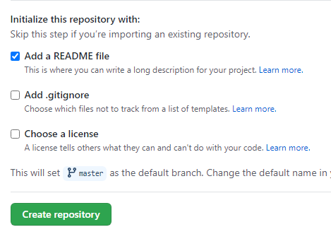

---

Hi guys! I trust y’all had a good day?

Our focus today is the amazing special feature for developers, designers etc. that was added by GitHub recently. This feature allows you to showcase yourself not just by building but by adding information about your work, portfolio and anything else on your GitHub Profile.

Have got some favorites readme i will like to share with you before we proceed:

Now let's create something magical 🤗

## Some prerequisite :

---

- Create a [GitHub](https://github.com/ 'GitHub') account
- Basic Markdown knowledge for smooth experience

## Steps are as follows:

- Create a new public repository with your username and ensure you use the same case as your github username.

  

- Click on the checkbox: Initialize this repository with a [README](https://en.wikipedia.org/wiki/README 'ReadMe') file. This will create a README.md file inside your repository.

  

- Now you can edit the readme to your taste. Remember, you can add images, text, list etc. You also get free template from GitHub out of the box.

  

You can checkout my on special 😎 repository on my [Profile](https://github.com/Olanetsoft 'GitHub')

### Link to useful Resources

---

- [GITHUB STAT CARD](https://github.com/anuraghazra/github-readme-stats#github-stats-card 'Stat Card')
- [THEME](https://github.com/anuraghazra/github-readme-stats#themes 'Theme')
- [TOP LANGUAGES CARD](https://github.com/anuraghazra/github-readme-stats#top-languages-card 'Top Lang')

At the end of this article, you have successfully set up your special repository.

I hope you find this article useful :)

Share a Link to your GitHub profile in the comment section, we will be glad to check it out 😉
