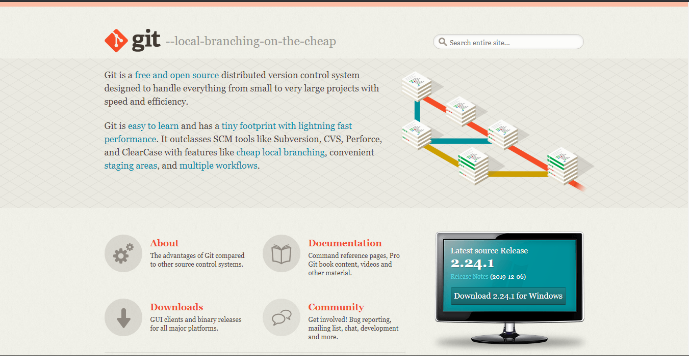
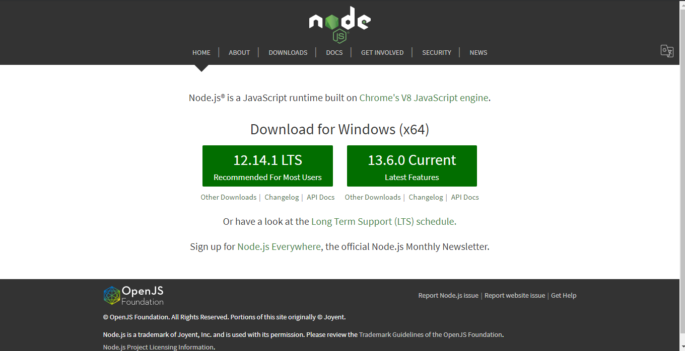

***
In this article, you will learn to install Git and Node on your computer. I will advise you follow along so as to achieve the same output as mine at the end of this article, I’m pretty sure its going to be cool

##Steps are as follows:
- Install Git on your computer
- Set up some of the basic global configurations for Git
- Installing Node
- Complete the set up of Node.js and NPM on your machine
- Verify that the installation was successful and your machine is ready for using Node.js and NPM.

##Install Git on your computer

- To install Git on your computer, go to https://git-scm.com/downloads to download the Git installer for your specific computing platform.
- Then, follow the installation steps as you install Git using the installer.
- You can find more details about installing Git at https://git-scm.com/book/en/v2/Getting-Started-Installing-Git. This document lists several ways of installing Git on various platforms.
- Installing some of the GUI tools like GitHub Desktop will also install Git on your computer.
On a Mac, setting up XCode command-line tools also will set up Git on your computer.
- You can choose any of the methods that is most convenient for you.
Some Global Configuration for Git

- Open a cmd window or terminal on your computer.
Check to make sure that Git is installed and available on the command line, by typing the following at the command prompt:

`git --version`

- To configure your user name to be used by Git, type the following at the prompt:

`git config --global user.name "Your Name"`

- To configure your email to be used by Git, type the following at the prompt:

`git config --global user.email <your email address>`

- You can check your default Git global configuration, you can type the following at the prompt:

`git config --list`

- At the end of this process, you should have Git available on the command-line of your computer.

##Installing Node

- To install Node on your machine, go to https://nodejs.org and click on the Download button. Depending on your computer’s platform (Windows, macOS or Linux), the appropriate installation package is downloaded.
- As an example, on a Mac, you will see the following web page. Click on the Download button. Follow along the instructions to install Node on your machine.
-- Note: Now Node gives you the option of installing a mature and dependable LTS version and a more newer stable version.

####Complete the set up of Node.js and NPM on your machine
- Open a terminal window on your machine. If you are using a Windows machine, open a cmd window or PowerShell window with admin privileges.

####Verify that the installation was successful and your machine is ready for using Node.js and NPM.
- To ensure that your NodeJS setup is working correctly, type the following at the command prompt to check for the version of Node and NPM

`node -v`

`npm -v`

At the end of this article, your machine is now ready with Git and Node installed for further development.

hope you find this article useful :)