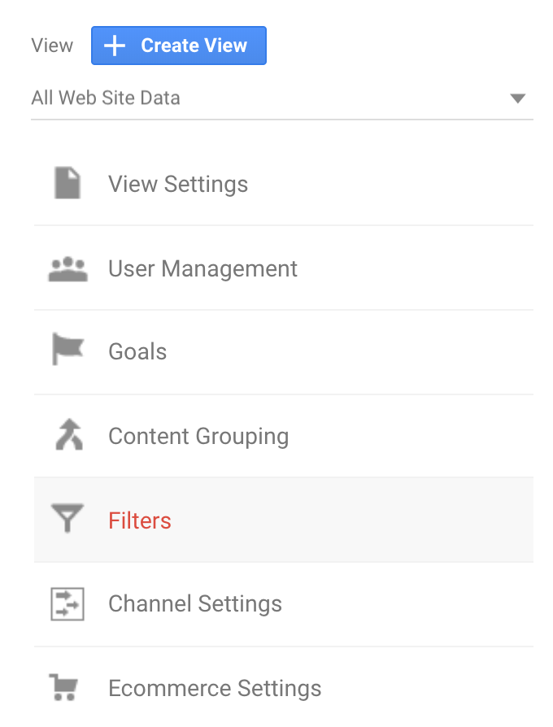
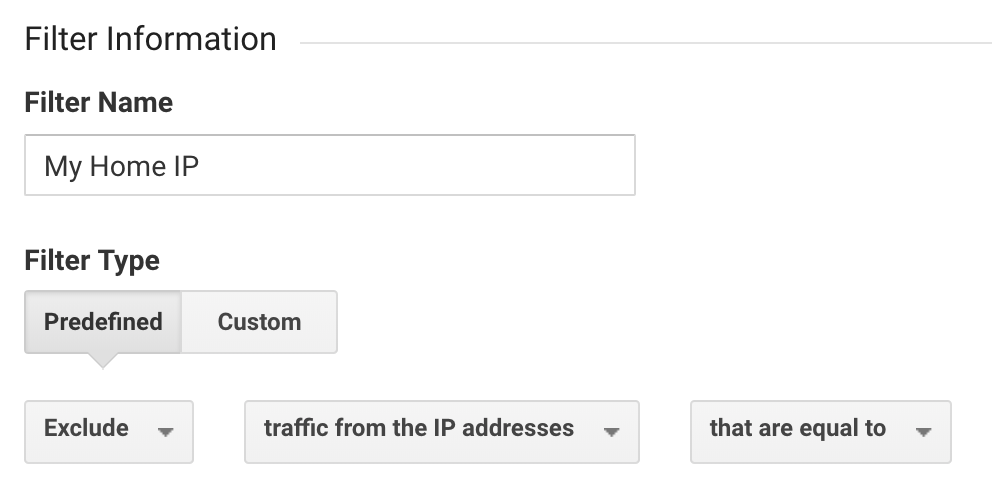

This is going to be a pretty brief post but the purpose of it is important. If you’ve gone to the trouble of setting up Google Analytics to monitor your website, then I’m pretty sure you don’t want noise from you visiting your own site or working on localhost to create a whole lot of noise in your Google Analytics data.

Login to your GA account and click on the gear icon in the bottom left. From here, click `Filters` in the right hand column, then click the red `Add Filter` button.

Select an appropriate name for your filter. I’ll call mine `My Home IP` as I will be adding my home IP address to the filter. In each dropdown select the following:
- Select filter type: Exclude
- Select source or destination: traffic from the IP addresses
- Select expression: that are equal to

Now you’ll need your IP address. To get this, open a new tab and type ‘my ip’ and hit enter. At the top of the results you should see your public IP address. Copy that, head back to GA and paste it into the input field under `IP address`.

Hit save and your done! It’s that easy. Now you can spend as much time on your site in any environment, while working from the IP address you just added, and you won’t become a part of your own data. Just be sure to add IP addresses to any other locations where you frequently work.
