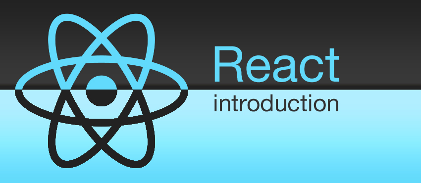
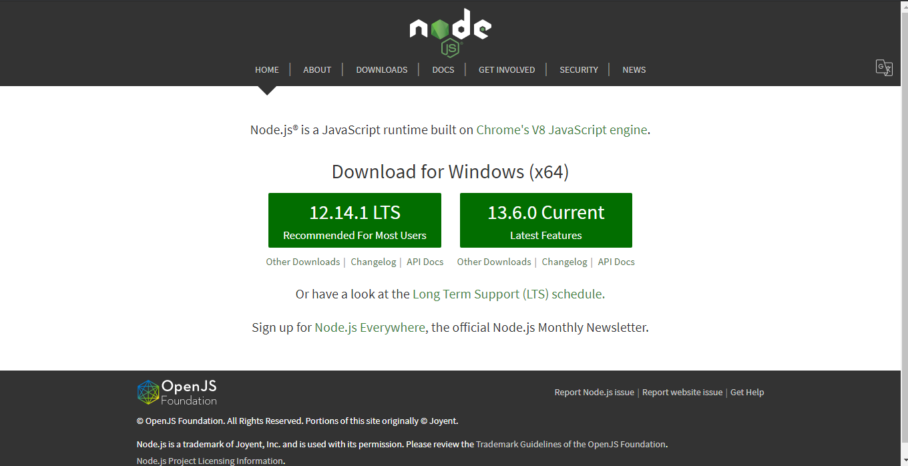
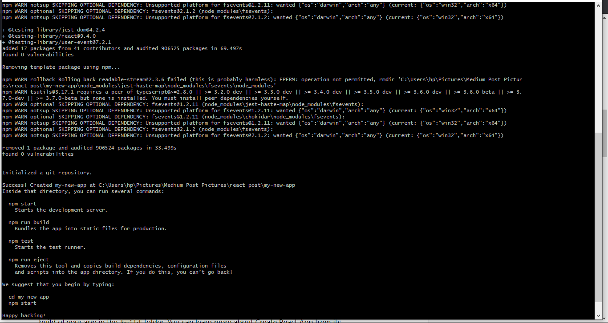
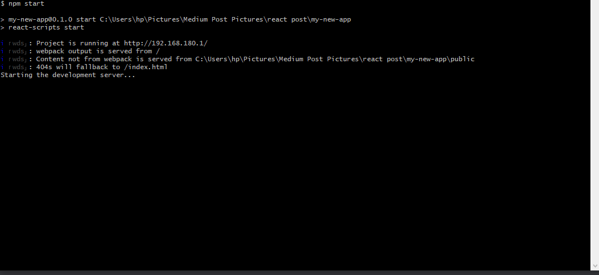
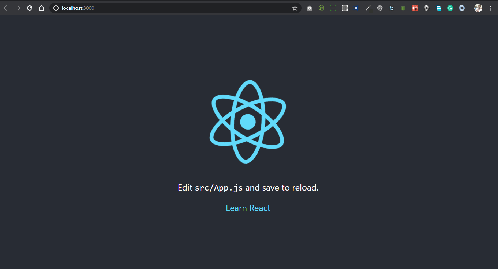

***
Hi guys! In this article, you will learn how to create React App stress free in some couple of minutes, i urge you to sit back and write some few command to get started 

## Objectives
***
- Introduction to React
- Installing Node (skip if you’ve Node installed already)
- Create React App
- Deploying the React App on Your localhost
- Link to useful Resources

## Introduction to React
***

- React has been designed from the start for gradual adoption, and you can use as little or as much React as you need. :)
- Whether you want to get a taste of React, add some interactivity to a simple HTML page, or start a complex React-powered app.
- React was initially developed by Jordan Walke, a software engineer at Facebook, who released an early prototype of React called “FaxJS.” It was first deployed on Facebook’s News Feed in 2011 and later on Instagram in 2012 and was open-sourced at JSConf US on 29th May 2013. It is maintained by Facebook and a community of developers.
- React has grown to be the developer’s choice as it has topped several polls and is highly demanded by several companies today.
- React is a declarative, efficient, and flexible frontend JavaScript library for building user interfaces. It lets you compose a complex user interface from small and isolated pieces of code called “components.”

#### Installing Node (skip if you’ve Node installed already)
***

- To install Node on your machine, go to [NODE](https://nodejs.org/en/ "Node Homepage") and click on the Download button. Depending on your computer’s platform (Windows, macOS or Linux), the appropriate installation package is downloaded.
- As an example, on a Mac, you will see the following web page. Click on the Download button. Follow along the instructions to install Node on your machine.
**Note: Now Node gives you the option of installing a mature and dependable LTS version and a more newer stable version.**

#### Complete the set up of Node.js and NPM on your machine
***
- Open a terminal window on your machine. If you are using a Windows machine, open a cmd window or PowerShell window with admin privileges.

#### Verify that the installation was successful and your machine is ready for using Node.js and NPM.
***
- To ensure that your NodeJS setup is working correctly, type the following at the command prompt to check for the version of Node and NPM

`node -v`

`npm -v`

Yes! we are getting closer to creating our React app

## Create React App
***
- Open your Terminal window and cd to any directory of your choice, afterward type the following at the command prompt.

`npx create-react-app my-new-app`

`cd my-new-app`

## Deploying the React App on Your localhost
***

`npm start`

Now I am sure the React App we just created is running on your default port. check your browser to see it live. screenshot Below

Congratulations! I have my React App up and running on port 3000, I hope sure yours is fine too :(

### Link to useful Resources
## GETTING STARTED REACT
***
- [NODE](https://nodejs.org/en/ "Node Homepage")
- [REACT COMMUNITY](https://reactjs.org/community/support.html "React Community")
- [REACT GITHUB PAGE](https://github.com/facebook/react "React Github")
- [REACT ON SLACK](https://slack.reactjsnews.com/ "React Slack")

At the end of this article, you have successfully set up your machine to create amazing web applications with React.

I hope you find this article useful :)